<div align="center">

# 🍔 Foodie — Food Delivery Website


A modern, fully responsive **food delivery landing page** built with pure **HTML, CSS, and JavaScript** — featuring a live cart system, interactive menu, reviews slider, and a clean yellow-themed UI.

**👨‍💻 Author:** Marnissi Ahmed Mustapha &nbsp;|&nbsp; **📅 Last Updated:** May 2026

[](https://github.com/AhmedMustaphaMarnissi)

</div>

---

## ⚡ TL;DR

A pixel-perfect **food delivery frontend** — fully responsive from mobile to desktop, with a working cart (add/remove items, live total), a food menu grid, testimonials slider, newsletter form, and a mobile hamburger menu. Zero frameworks, zero dependencies.

---

## 📋 Table of Contents

- [Overview](#overview)
- [Sections & Screenshots](#sections--screenshots)
  - [Hero](#-hero)
  - [Services](#-services)
  - [Menu](#-menu)
  - [Reviews](#-reviews)
  - [Cart](#-cart)
  - [Mobile App Section](#-mobile-app-section)
  - [Newsletter & Footer](#-newsletter--footer)
  - [Responsive Design](#-responsive-design)
- [Features](#features)
- [Tech Stack](#tech-stack)
- [How to Run](#how-to-run)
- [What I Learned](#-what-i-learned)

---

## Overview

**Foodie** is a complete food delivery website front-end. It presents a restaurant's brand, showcases the menu with prices and add-to-cart functionality, collects customer testimonials, promotes a mobile app, and ends with a newsletter subscription and a fully structured footer — all in a single HTML page with a consistent warm yellow color theme.

---

## Sections & Screenshots

### 🏠 Hero

Full-width landing section with the brand name **Foodie.**, a bold headline, tagline, **Order now** CTA button, and social media links (X, Instagram, Facebook, Google+). The navigation bar includes links to Home, Services, Menu, About us, and Contacts, plus a cart icon with item count badge and a **Sign in** button.

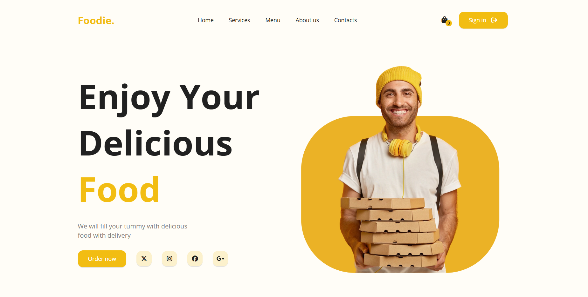

---

### ⚙️ Services

Three-card section explaining how the service works: **Easy To Order**, **Fast Delivery**, and **Best Quality** — each with a custom icon and short description.

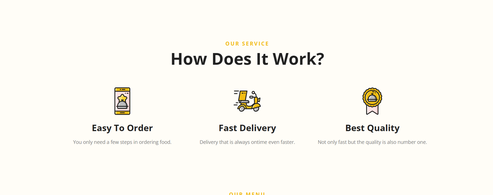

---

### 🍽️ Menu

**"The Most Popular"** food menu grid with 8 items displayed in a 4-column layout. Each card shows a food image, name, price, and an **Add to cart** button. Items include: Double Beef Burger, Veggie Pizza, Fried Chicken, Chicken Roll, Sub Sandwich, Chicken Lasagna, Italian Spaghetti, and Spring Roll.

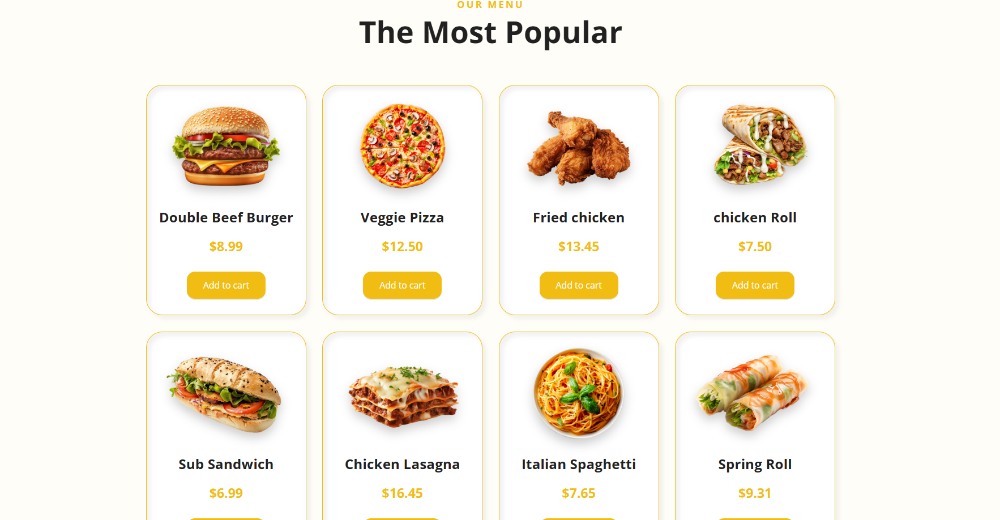

---

### ⭐ Reviews

Customer testimonials section **"What They Say?"** — a slider showing reviewer photo, name, star rating, and written review, with left/right navigation arrows.

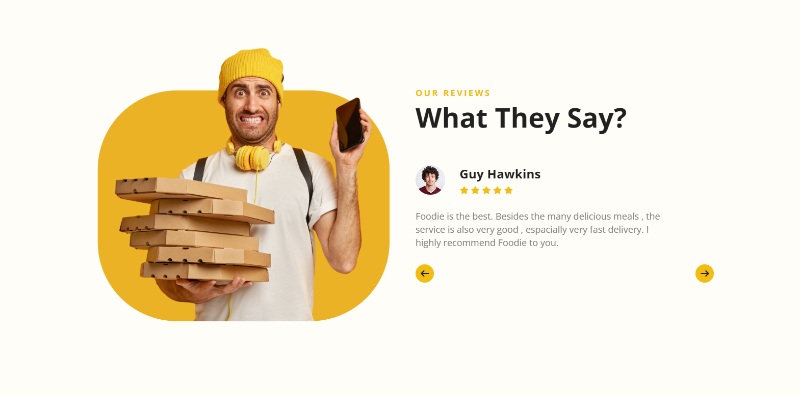

---

### 🛒 Cart

A slide-in cart sidebar triggered by clicking the cart icon. Shows all added items with thumbnail, name, quantity controls (+/−), and individual totals. Displays the **grand total** at the bottom with **Close** and **Check out** buttons. The cart icon badge updates live with item count.

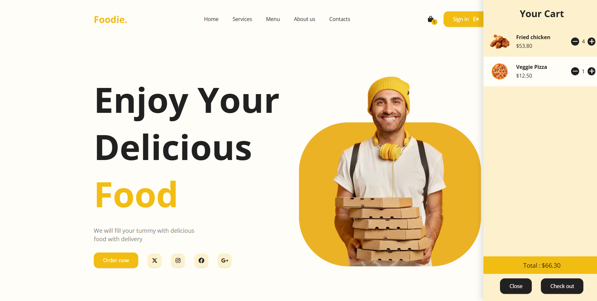

---

### 📱 Mobile App Section

Promotional banner section with a phone mockup showcasing the app UI — **"Simple Way To Order Your Food"** with a **Get the App** button.

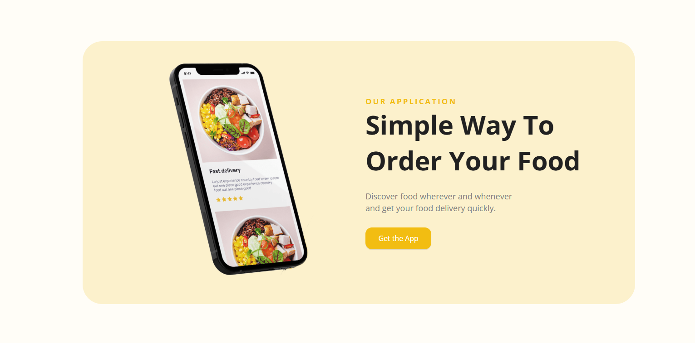

---

### 📧 Newsletter & Footer

Newsletter subscription section with an email input and **Subscribe** button. The footer is structured into four columns: brand tagline + social links, **Our Menu** (Special, Popular, Categories), **Company** (Why Foodie, Partner with us, About us, FAQ's), and **Support** (Account, Support center, Feedback, Contacts).

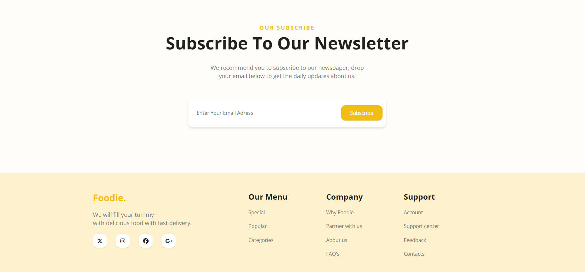

---

### 📱 Responsive Design

Fully responsive across all screen sizes. On mobile: navigation collapses into a **hamburger menu**, layout stacks vertically, hero text reflows, and the menu grid adapts to a single column.

| Mobile Home | Mobile Menu | Mobile Reviews | Mobile Services |
|---|---|---|---|
| 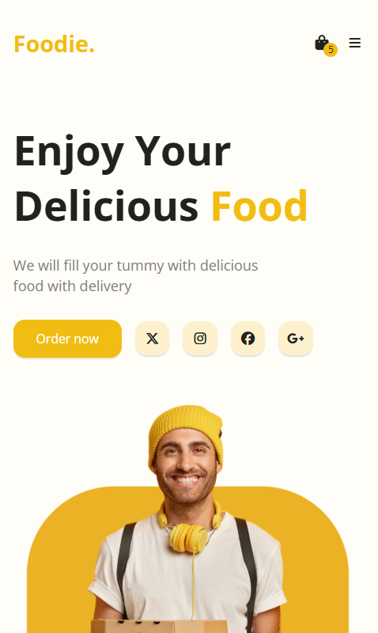 | 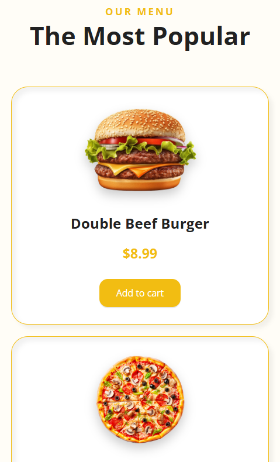 | 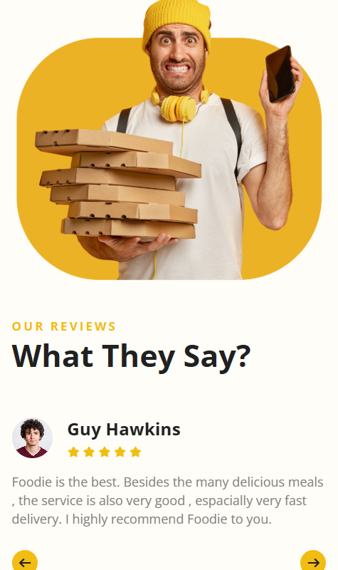 | 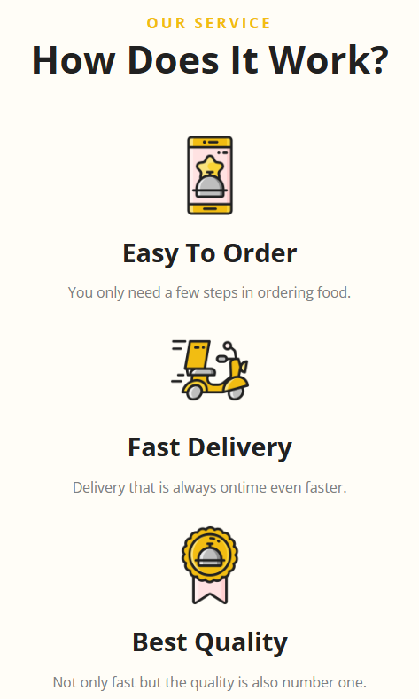 |

---

## Features

- **Live cart system** — add items, adjust quantities, remove items, auto-calculated total
- **Cart badge** — live item count on the cart icon in the navbar
- **Responsive layout** — fully adaptive from 320px mobile to wide desktop
- **Hamburger menu** — mobile navigation with toggle animation
- **Reviews slider** — navigable testimonials with prev/next arrows
- **Newsletter form** — email subscription input
- **Social media links** — X, Instagram, Facebook, Google+
- **Clean yellow theme** — consistent `#f5a623` accent color throughout
- **Smooth scroll** — anchor navigation between page sections
- **Zero dependencies** — pure HTML + CSS + Vanilla JS, no libraries

---

## Tech Stack

| Technology | Usage |
|---|---|
| HTML5 | Page structure and semantic markup |
| CSS3 | Styling, Flexbox, Grid, media queries, transitions |
| JavaScript (Vanilla) | Cart logic, slider, hamburger menu, DOM manipulation |

---

## How to Run

No setup needed — just open the file in your browser.

```bash
git clone https://github.com/ahmedmustaphamarnissi/food-delivery-website.git
cd food-delivery-website
```

Then double-click `index.html` or open it with Live Server in VS Code.

---

## 🧠 What I Learned

- Building a **complete single-page website** from scratch with no frameworks
- Implementing a **cart system** with JavaScript: add, remove, quantity update, live total
- Creating a **responsive navbar** with hamburger toggle for mobile
- Building an **image + content slider** with JavaScript navigation
- Designing a **multi-column footer** with clean CSS Grid
- Mastering **CSS Flexbox and Grid** for complex multi-section layouts
- Using **CSS custom properties** for consistent theming
- Writing clean, organized Vanilla JS for DOM manipulation and state management

---

<div align="center">

Built with ❤️ in Bizerte, Tunisia 🇹🇳

[](https://github.com/AhmedMustaphaMarnissi)

</div>
